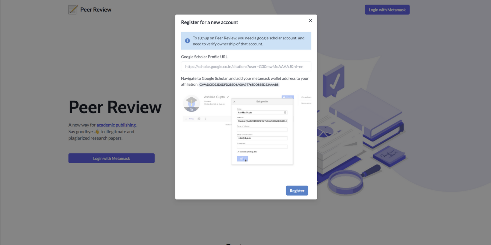
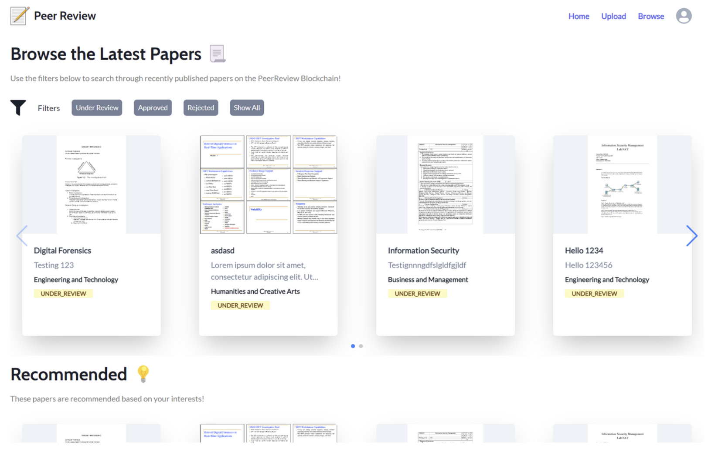
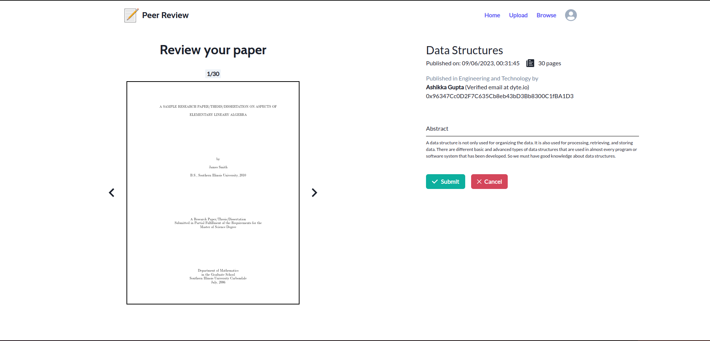
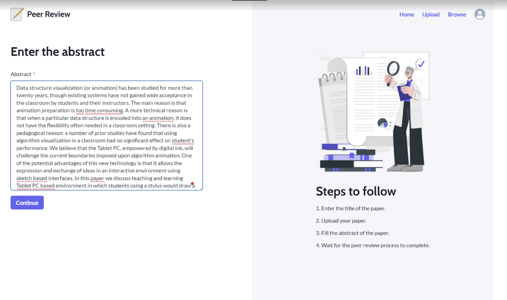
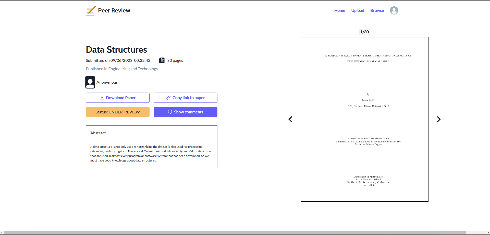
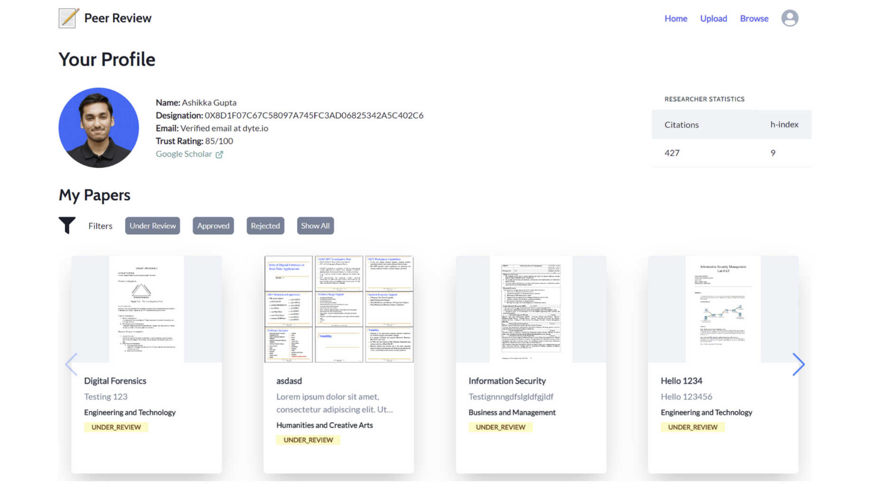

<!-- PROJECT LOGO -->
<br />
<p align="center">
  <a href="https://github.com/ashikka/peer-review-chainlink">
    
  </a>

  <h3 align="center"><b>Peer Review</b></h3>

  <p align="center">
    A Decentralized Academic Publishing System Using Smart Contracts
    <br />
    <a href="https://github.com/ashikka/peer-review-chainlink"><strong>Explore the docs »</strong></a>
    <br />
    <br />
    <a href="https://github.com/ashikka/peer-review-chainlink">View Demo</a>
    ·
    <a href="https://github.com/ashikka/peer-review-chainlink/issues">Report Bug</a>
    ·
    <a href="https://github.com/ashikka/peer-review-chainlink/issues">Request Feature</a>
  </p>
</p>


<!-- TABLE OF CONTENTS -->
## Table of Contents

* [About the Project](#about-the-project)
  * [Built With](#built-with)
* [Getting Started](#getting-started)
  * [Prerequisites](#prerequisites)
  * [Installation](#installation)
* [Usage](#usage)
* [Roadmap](#roadmap)
* [Contributing](#contributing)
* [License](#license)
* [Contributors](#contributors-)


<!-- ABOUT THE PROJECT -->
## About The Project

### The Problem

A rising issue observed in the world of academia and research is Predatory Publishing. This refers to the act of journals charging “publication fees” from researchers to publish papers, often those lacking quality to have any real academic relevance. Journals don’t check the legitimacy of the article, and most papers published in these journals are just derivatives of other works (plagiarism).
No transparent peer-review process, even if the journal claims to do one. How do we trust if first reviews were conducted, and second, were they conducted by qualified peers? Journals are controlled by central authorities with financial motives, there is a lot of corruption. Preference is given to people willing to pay a higher sum of money.

### Introducing PeerReview!
PeerReview is a project which aims to decentralize the process of peer reviewing research papers with the help of Ethereum, Smart Contracts, and Blockchain. Some features of PeerReview include:

1. Completely anonymous users, we don't store any data to identify users on our blockchain
2. Upload papers with ease, and in less than 2 minutes!
3. Reviews are transparent, and honest. We integrate with Google Scholar to generate a "trust rating" for users, and then use this to evaluate a user's action on our network.
4. Get feedback from reviewers, and accomodate changes to your paper.
5. Reviewers are rewarded for their work in the form of Ether.
6. Completely compatible with Metamask!

## Demo
[Checkout the Demo on Youtube!](https://www.youtube.com/watch?v=VTRrkXzapfw)


### Built With

* [Typescript](https://www.typescriptlang.org/)
* [React](https://reactjs.org/)
* [Ethers.js](https://docs.ethers.io/v5/)
* [Metamask](https://metamask.io/)
* [Express](https://expressjs.com/)
* [Hardhat](https://hardhat.org/)
* [Ganache](https://trufflesuite.com/ganache/)
* [MongoDB](https://www.mongodb.com/)


<!-- GETTING STARTED -->
## Getting Started

To get a local copy up and running follow these simple steps.

### Prerequisites

This is an example of how to list things you need to use the software and how to install them.
* npm
```sh
npm install npm@latest -g
```
* Ganache

[Download and install Ganache from its phome page](https://trufflesuite.com/ganache/). Make sure
a local ethereum blockchain is running on ganache.

* MongoDB

Make sure a MongoDB database is running either on your local network, or on a remote URL.

### Installation
 
1. Clone the repo
```sh
git clone https://github.com/ashikka/peer-review-chainlink.git
```
2. Install the NPM dependencies
```sh
npm install

cd ./frontend
npm install

cd ../backend
npm install
```
3. Setup `.env` files:

First, make a `.env` in the root folder of the project:
```
PRIVATE_KEY=<Private key of an account from ganache>
DEV_URL=<GanacheURL>
WALLET_ADDRESSES=<Optional list of wallet addresses to deposit amounts to. (comma seperated)>
MONGO_URL=<Mongo database URL>
```

Now run the `reset.ts` script using hardhat to generate the remaining `.env` files for the frontend and backend.

```sh
npx hardhat run scripts/reset.ts
```

4. Finally startup the frontend and backend for the project:
```sh
cd frontend
npm start

# On another terminal
cd backend
npm start
```


<!-- USAGE EXAMPLES -->
## Usage
Here are some screenshots demonstrating how to use this project:

### Easy signup using Google Scholar
The first step to using PeerReview is to signup for an account. This can be done by linking your existing Gooogle Scholar Profile to create a user on our blockchain:



### Browse for Papers
After you are logged in, you can browse existing papers on our blockchain, and view them, or even review them!



You can click on any paper on the browse screen to view more details, or leave a review about that paper:



### Upload your Research Paper

You can also upload research papers of your own, using the upload screen:





### View your Profile

You can view your trust rating, and more details about your profile on the profile page screen:




<!-- ROADMAP -->
## Roadmap

See the [open issues](https://github.com/ashikka/peer-review-chainlink/issues) for a list of proposed features (and known issues).


<!-- CONTRIBUTING -->
## Contributing

Contributions are what make the open source community such an amazing place to be learn, inspire, and create. Any contributions you make are **greatly appreciated**.

1. Fork the Project
2. Create your Feature Branch (`git checkout -b feature/AmazingFeature`)
3. Commit your Changes (`git commit -m 'feat: Add some AmazingFeature'`)
4. Push to the Branch (`git push -u origin feature/AmazingFeature`)
5. Open a Pull Request

You are requested to follow the contribution guidelines specified in [CONTRIBUTING.md](./CONTRIBUTING.md) while contributing to the project :smile:.

<!-- LICENSE -->
## License

Distributed under the MIT License. See [`LICENSE`](./LICENSE) for more information.


<!-- MARKDOWN LINKS & IMAGES -->
<!-- https://www.markdownguide.org/basic-syntax/#reference-style-links -->
[issues-shield]: https://img.shields.io/github/issues/ashikka/peer-review-chainlink.svg?style=flat-square
[issues-url]: https://github.com/ashikka/peer-review-chainlink/issues
